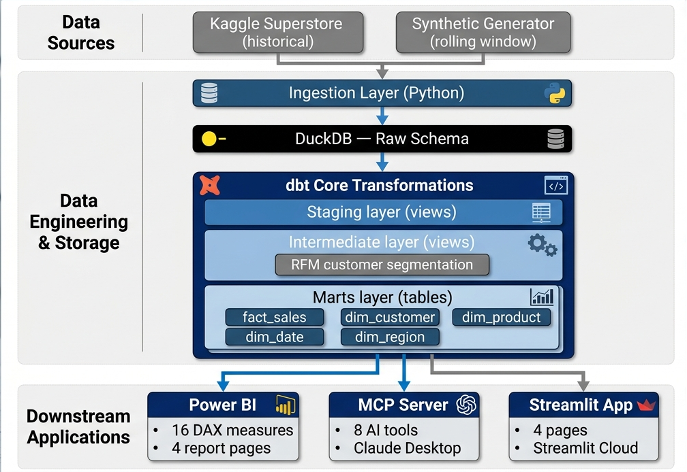
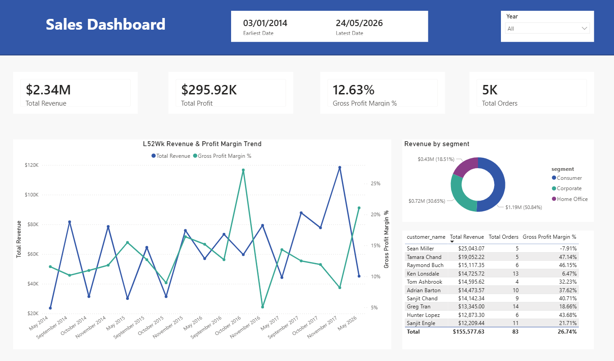
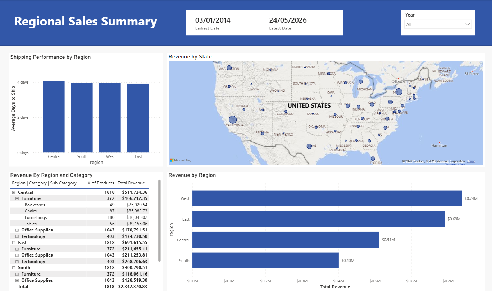
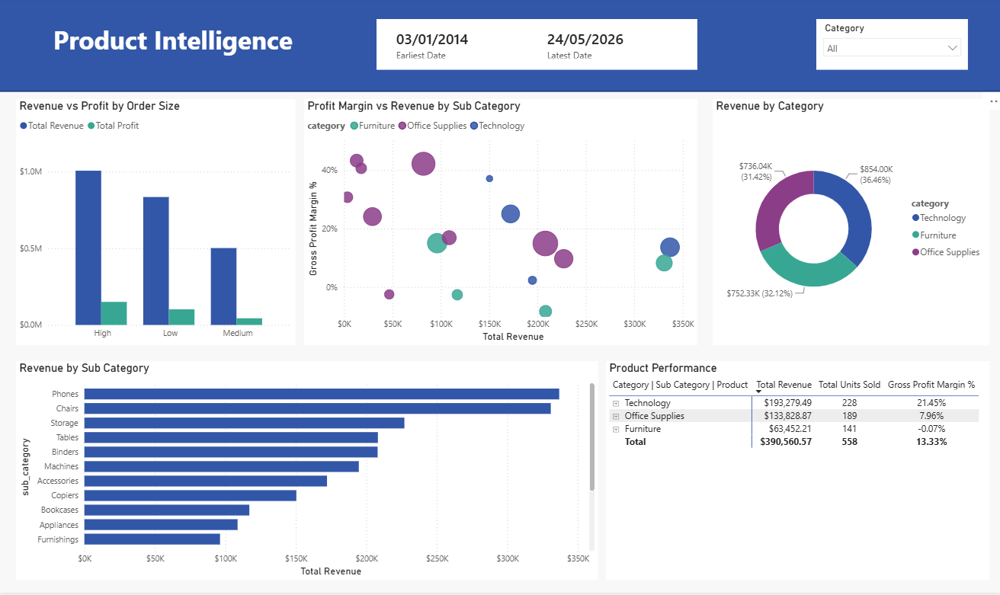
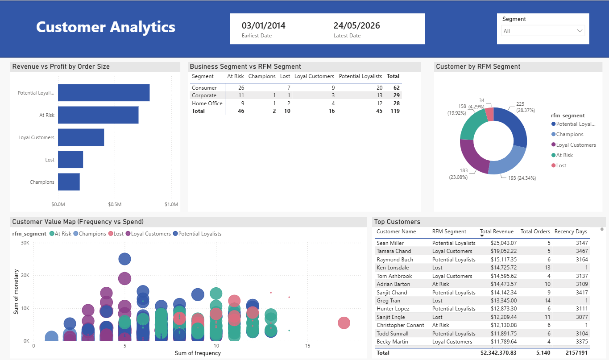
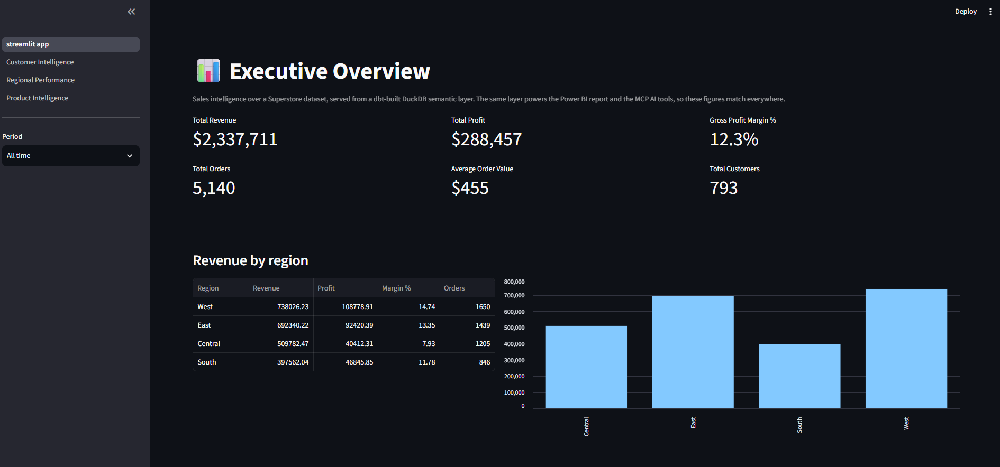
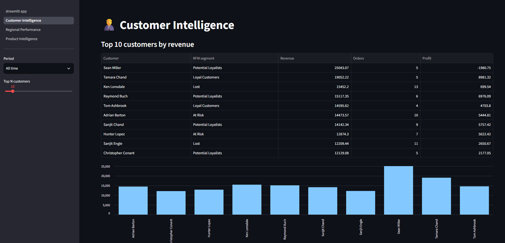
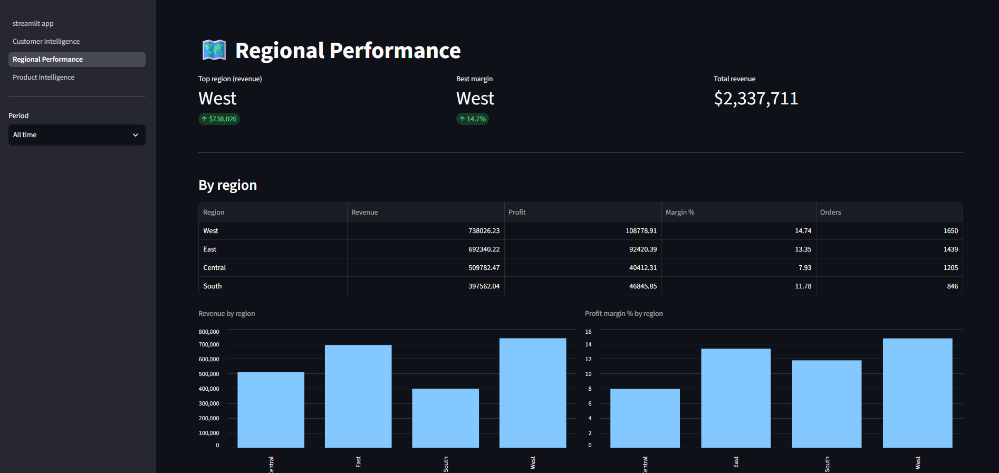
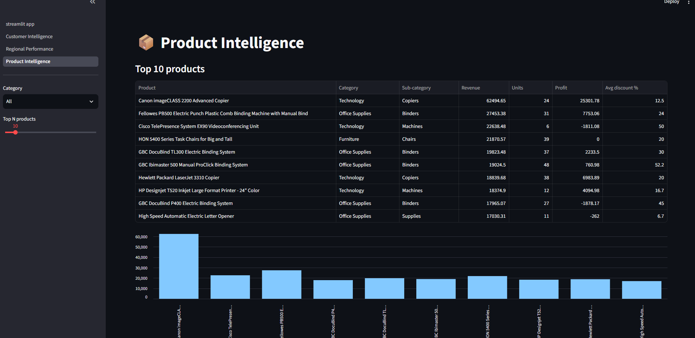

# SalesInsight — AI-Powered Sales Intelligence Platform

[](https://github.com/arman-sakif/SalesInsight/actions/workflows/ci.yml)
[](https://github.com/arman-sakif/SalesInsight/actions/workflows/refresh-data.yml)

### 🚀 [Live app → sales-insight-9011.streamlit.app](https://sales-insight-9011.streamlit.app/)

An end-to-end analytics platform: a dbt-modelled warehouse feeding a Power BI report, an MCP server that lets an AI assistant query the same numbers, and a deployed web app — with CI/CD that rebuilds and republishes the whole thing on a schedule. Built entirely with free and open-source tools.

**The design principle behind it:** every consumer reads from one dbt-built semantic layer. The Power BI report, the AI tools, and the web app all resolve a metric like *gross profit margin* through the same SQL definition, so the three surfaces cannot disagree with each other.

---

## What this project demonstrates

| Area | What was built |
|---|---|
| **Data engineering** | Ingestion pipeline from a Kaggle source plus a statistical synthetic-order generator, landing in DuckDB |
| **Analytics engineering (dbt)** | 10 models across a staging → intermediate → marts architecture, 23 data tests, star schema, RFM segmentation in SQL |
| **Data quality** | A column-rotation defect in the source data corrected in staging with zero row loss |
| **BI development** | Power BI semantic model — star schema, 16 DAX measures, time intelligence, 4 report pages |
| **AI integration** | An MCP server exposing 8 tools over the warehouse, connected to Claude Desktop |
| **Web development** | A deployed 5-page Streamlit app reusing the MCP tool functions directly |
| **DevOps** | Two GitHub Actions workflows — CI on every PR, plus a scheduled job that rebuilds the data and redeploys the live app |
| **Testing & tooling** | ruff linting and 172 pytest tests in CI, alongside the 23 dbt data tests |

---

## Architecture



---

## Tech Stack

- **Language:** Python 3.12
- **Package management:** uv
- **Warehouse:** DuckDB (local, file-based)
- **Transformations:** dbt Core with the dbt-duckdb adapter
- **Dashboard:** Power BI Desktop
- **Web app:** Streamlit, deployed on Streamlit Community Cloud
- **AI integration:** Model Context Protocol (MCP) server, connected to Claude Desktop
- **CI/CD:** GitHub Actions, pytest, ruff

---

## Data

- **Source:** [Kaggle Sample Superstore](https://www.kaggle.com/datasets/konstantinognev/sample-superstorecsv)
- **Historical rows:** 9,994 real orders (2014–2017)
- **Synthetic rows:** a rolling window of recent orders generated from distributions fitted to the real data, so the dashboard has current activity to show
- **Data quality:** the staging layer corrects a column-rotation defect in the source with no data loss

Figures below marked **≈** are approximate: the synthetic window is regenerated on every scheduled refresh, so they move slightly week to week. The 9,994 historical rows are fixed.

| Measure | Current |
|---|---|
| Fact table rows | ≈18,700 order lines |
| Distinct orders | ≈13,700 |
| Customers | ≈790 |
| Products | ≈1,860 |
| Total revenue | ≈$5.57M |
| Gross profit margin | ≈8.1% |

The synthetic window is a rolling **90 days**, which is what makes the "Last 30 days" and "Last 90 days" filters and the daily trend line meaningful. It is deliberately higher-volume than the historical extract, so all-time totals are weighted toward it.

---

## dbt Modelling

A three-layer architecture, each layer with a single responsibility.

### Staging — clean and conform
| Model | Description |
|---|---|
| `stg_orders` | Cleaned and typed orders with date parsing, category correction, and a synthetic flag |
| `stg_customers` | Distinct customers with segment |
| `stg_products` | Distinct products, deduplicated and category-corrected |

### Intermediate — business logic
| Model | Description |
|---|---|
| `int_orders_enriched` | Orders joined to products with derived metrics (profit margin, days to ship) |
| `int_customer_segments` | RFM-scored customers labelled Champions, Loyal Customers, Potential Loyalists, At Risk, and Lost |

### Marts — the star schema consumers read
| Model | Description |
|---|---|
| `fact_sales` | One row per order line, the central fact table |
| `dim_customer` | One row per customer with RFM segment |
| `dim_product` | One row per product with category hierarchy |
| `dim_date` | Date spine from 2014 to today with calendar attributes |
| `dim_region` | One row per region (West, East, Central, South) |

**Testing:** 23 dbt data tests — 16 not-null and 7 uniqueness constraints across the staging, intermediate, and marts layers. `dbt build` runs 33 nodes in total (10 models + 23 tests), and CI fails the build if any of them fail.

**RFM segmentation** is implemented in SQL rather than as a Python post-process: `int_customer_segments` scores recency, frequency, and monetary value into quartiles with `ntile(4)` window functions and maps the combination to a segment label. Because it lives in the model layer, the segment reaches Power BI, the AI tools, and the web app identically.

---

## Power BI Semantic Model

- 4 active relationships forming a star schema
- 16 DAX measures across revenue, profit, customers, time intelligence, and shipping
- 5 calculated columns
- Time intelligence: MTD, YTD, vs Prior Month, vs Prior Year

Power BI imports the Parquet exports rather than connecting to DuckDB directly — see [Engineering decisions](#engineering-decisions) for why.

### Dashboard Preview

Four pages, each targeting a different analytical question while sharing the same star schema and measures.

**Executive Summary** — Headline KPIs (total revenue, total profit, gross profit margin, total orders), a rolling 52-week revenue and profit-margin trend, revenue split by customer segment, and a top-customers table.



**Regional Sales Summary** — Shipping performance by region, revenue mapped by state, a region → category → sub-category revenue breakdown, and revenue ranked by region.



**Product Intelligence** — Revenue vs. profit by order size, a profit-margin vs. revenue scatter by sub-category, revenue by category, revenue by sub-category, and a product performance table.



**Customer Analytics** — Revenue vs. profit by order size, a business-segment vs. RFM-segment matrix, customer distribution by RFM segment, a frequency-vs-spend value map, and a top-customers table with recency.



---

## MCP Server

A Model Context Protocol server that exposes the warehouse as AI-queryable tools. Connected to Claude Desktop, it answers natural-language questions from the live DuckDB warehouse — the same semantic layer the Power BI report visualizes.

The server opens DuckDB **read-only**, so an AI tool call can never write to the warehouse and never contends with dbt for the single-writer lock.

### Available Tools

Every tool that reads the fact table takes the same two filters — `period` (`all_time`, `this_year`, `last_year`, `last_30_days`, `last_90_days`, or a year) and `regions` — so the assistant can narrow any answer the same way the dashboard does.

| Tool | Description | Extra filters |
|---|---|---|
| `query_metric` | Query a core metric (revenue, profit, margin, orders, AOV, units, customers) | — |
| `explain_metric` | Explain what a metric means and how it's calculated | not filtered |
| `get_top_customers` | Top N customers by revenue with RFM segment | `segments` |
| `get_rfm_segments` | Customer distribution across RFM segments | — |
| `revenue_by_region` | Revenue, profit, and margin by region | — |
| `get_product_performance` | Top products, optionally filtered by category | `sub_categories` |
| `get_category_breakdown` | Revenue, margin, and average discount by category and sub-category | `categories` |
| `get_discount_impact` | Discount-vs-margin analysis: revenue, margin, and profit by discount band | `categories` |

The period vocabulary is built in one place (`mcp_server/tools/_filters.py`) rather than reimplemented per module, which is what keeps "this year" meaning the same thing to the AI, the dashboard, and the report.

### Example

> **You:** What's my total revenue and gross profit margin?
>
> **Claude:** *(calls `query_metric` twice)* Your total revenue is ≈$5.57M with a gross profit margin of ≈8.1%.

`explain_metric` is the tool worth noting: it returns the definition **and the SQL expression** behind a metric, so the assistant can show its working rather than asking you to trust a number.

---

## Web App (Streamlit)

A five-page dashboard in the browser — no Power BI Desktop required. Each page calls the exact MCP tool functions, so the web figures match the Power BI report and the AI answers by construction rather than by discipline.

**🚀 Live: [sales-insight-9011.streamlit.app](https://sales-insight-9011.streamlit.app/)**

```bash
uv run streamlit run app/streamlit_app.py
```

One filter panel scopes every page — period, region, and, where they apply, category, sub-category, and RFM segment. Selections persist across navigation, and the active slice is printed under the page title so you always know what you are looking at. Periods are built from the data at runtime rather than hardcoded, so an option that would return nothing is never offered.

**Executive Overview** — Six headline KPIs with period-over-period deltas, a revenue trend that switches grain with the selection, and a state choropleth beside the region summary.



**Trends** — Daily revenue with a 7-day trailing average for the live window, and monthly revenue against profit for the 2014–2017 history.

**Customer Intelligence** — A recency × frequency heatmap shaded by revenue, segment revenue, and top-N customers with a share-of-total bar.



**Regional Performance** — The state choropleth at full size with a ranked state table, plus the four-region summary.



**Product Intelligence** — Top products by category, a Pareto curve of catalogue concentration, a category × sub-category heatmap, and discount-vs-margin with a zero-margin reference line.



### Charting decisions

Charts are Altair, which already ships with Streamlit — adding Plotly would have been a dependency for no gain. Three rules the visuals are held to, because each is a way dashboards quietly mislead:

- **No dual-axis charts.** Revenue and profit share one axis on the Trends page; they are both dollars, and the distance between the lines *is* the margin story. A second y-scale would rescale that gap into a coincidence. The Pareto chart drops the conventional revenue bars for the same reason and keeps the cumulative curve, with the ranked table beside it.
- **The palette is validated, not chosen.** The eight categorical hues were run through a colour-vision-deficiency check: every adjacent pair clears a protan/deutan/tritan separation threshold against the page surface. Slots are assigned in fixed order and scales pin an explicit domain, so filtering a region out cannot repaint the survivors. The app follows the viewer's light or dark theme, and dark is a second validated palette rather than the light one inverted — including the sequential ramp, which runs the other way so magnitude still reads as distance from the page.
- **Colour never carries a value alone.** Every chart has a table beside or beneath it, which is also what makes the two lower-contrast hues legitimate.
- **A tooltip has to be reachable.** Line charts hover by nearest point on a full-height crosshair rule rather than asking the reader to land on a 2px stroke, and the 14px discount bars carry a wider invisible hit band. The tables stay regardless: tooltips enhance, they are never the only way to read a value.

---

## CI/CD (GitHub Actions)

| Workflow | Trigger | What it does |
|---|---|---|
| `ci.yml` | every pull request and push to `master` | Lints with ruff, rebuilds the warehouse from the committed CSV, runs `dbt build` (10 models + 23 data tests), exports the marts, and runs 172 pytest tests over the tool layer, the app queries, the chart builders, and every Streamlit page |
| `refresh-data.yml` | weekly cron + manual dispatch | Runs the same pipeline, then commits the refreshed `data/parquet/*.parquet` back to `master`, which triggers a Streamlit Community Cloud redeploy |

The second workflow is the interesting one: it closes the loop from raw data to deployed dashboard with no human in it. A scheduled run rebuilds the warehouse, regenerates the recent-orders window, revalidates every dbt test, and publishes the result — so the live app keeps showing current data without anyone touching it.

Two details worth calling out:

- **No secrets in CI.** `kaggle_loader.py --local` loads the CSV snapshot committed at `data/raw/superstore.csv` instead of re-downloading the dataset, so both workflows run with zero configured credentials.
- **The refresh regenerates rather than appends.** `warehouse.db` is gitignored, so each run starts from the raw CSV and generates a rolling window through today (`synthetic_generator.py --days 90`). This keeps the pipeline reproducible: the same commit always produces the same shape of warehouse.

### Retention

`synthetic_generator.py` applies a one-year retention policy after generating, so the warehouse keeps at most 365 days of generated history:

```bash
uv run python ingestion/synthetic_generator.py --days 90 --retain-days 365 # what CI runs
uv run python ingestion/synthetic_generator.py --days 0                    # prune only, generate nothing
uv run python ingestion/synthetic_generator.py --no-prune                  # generate without pruning
```

It deletes only rows carrying a `SYN-` prefix. The 2014–2017 Kaggle baseline is never pruned — it is the historical data the year-over-year views and RFM recency scores are built on, and a blanket cutoff would take all 9,994 rows of it.

---

## Engineering decisions

The constraints that shaped the design, and how each was resolved.

**Power BI cannot read DuckDB directly.** The ODBC driver fails because Power BI spawns parallel Mashup processes that collide on DuckDB's single-writer lock. Rather than switch warehouses, the pipeline exports each mart to Parquet and Power BI imports those — which also made the marts portable enough to deploy the web app later.

**The web app has no warehouse to read.** Streamlit Community Cloud only has the committed repo, and `warehouse.db` is gitignored. The connection helper detects this and builds an in-memory DuckDB with the Parquet marts registered as views under the same schema name, so every query in the tool layer runs unchanged against either source. One code path, two environments.

**A filter that appears to apply and doesn't is worse than no filter.** Four of the eight MCP tools were all-time only, while the dashboard rendered a Period selector above the panels they fed — so on one page the slicer moved and nothing underneath it changed. The fix was to push `period` and `regions` down into every tool rather than to hide the widget, which incidentally made the AI able to answer "top products this quarter" too. The period vocabulary now lives in one module instead of three near-copies, and the page tests assert that changing a filter changes the render.

**Two data sources, eight years apart.** The Superstore extract ends in 2017 and the synthetic feed is a rolling window ending today, so any single time series drawn across the whole dataset is mostly a flatline through a gap that does not mean "no sales". The Trends page therefore has two panels split on `is_synthetic`, and the period options are generated from the years that actually contain orders — which is why "Last year" simply does not appear in the dropdown rather than appearing and returning nothing.

**A blanket retention policy would have destroyed the analysis.** "Delete everything older than a year" would have dropped all 9,994 historical rows and left only the synthetic window — collapsing the year-over-year comparisons and flattening RFM recency to a few days. Retention is therefore scoped to synthetic rows only, which is also what makes the date comparison safe, since the two sources write dates in different formats.

**Weekly refresh, not daily.** Each refresh rewrites roughly 500 KB of binary Parquet. Daily commits would add ~190 MB of history a year to a repo that is otherwise ~3 MB. Weekly keeps the live app current at a fraction of the cost; the cron is a one-line change to `"0 6 * * *"` if daily is ever wanted.

**A silent data-corruption bug, caught by a test.** Appending synthetic rows used a positional `INSERT`, but the source CSV and the generated frame order three columns differently — so every synthetic row was written with those values rotated. A single rotation was invisible, because the staging layer's existing column-rotation fix undid it exactly. But the generator reads its product reference data back out of the raw table, so each additional day of generation rotated the values again, until product names ended up in the category column. It was caught by a test asserting the category breakdown contains only the three real categories, and fixed by making the insert match on column name rather than position. The test now guards against regression.

---

## How to Run Locally

**Prerequisites:** Python 3.12+, uv, git

```bash
# Clone the repo
git clone https://github.com/arman-sakif/SalesInsight.git
cd SalesInsight

# Install dependencies
uv sync

# Set up environment variables
cp .env.example .env
# Add your KAGGLE_USERNAME and KAGGLE_KEY to .env

# Run ingestion
uv run python ingestion/kaggle_loader.py
uv run python ingestion/synthetic_generator.py

# Run dbt transformations
cd dbt_project
uv run dbt build
cd ..

# Export to Parquet for Power BI
uv run python ingestion/export_parquet.py

# Test the MCP server in the MCP Inspector
uv run mcp dev mcp_server/server.py

# Launch the Streamlit web app
uv run streamlit run app/streamlit_app.py

# Run the checks CI runs
uv run ruff check .
uv run pytest
```

No Kaggle account? Skip the `.env` step and load the committed CSV snapshot instead:

```bash
uv run python ingestion/kaggle_loader.py --local
```

`synthetic_generator.py` appends one day of orders by default; pass `--days 90` to generate the rolling window CI builds. It always appends to whatever is already in `raw.raw_orders`, so re-run `kaggle_loader.py --local` first if you want a clean rebuild rather than more history. It also prunes generated history older than a year on each run — see [Retention](#retention).

The dbt profile is committed at `dbt_project/profiles.yml` and resolves a relative path to the warehouse, so a fresh clone builds without any machine-specific configuration.

### Connecting the MCP Server to Claude Desktop

Add the following to your `claude_desktop_config.json` (adjust the paths to match your machine), then restart Claude Desktop:

```json
{
  "mcpServers": {
    "salesinsight": {
      "command": "C:\\Users\\<you>\\.local\\bin\\uv.exe",
      "args": [
        "--directory",
        "C:\\path\\to\\SalesInsight",
        "run",
        "python",
        "-m",
        "mcp_server.server"
      ]
    }
  }
}
```

---

## Project Background

Built as a portfolio project following completion of a Master of Applied Computing (Artificial Intelligence) at the University of Windsor. Demonstrates skills in data engineering, analytics engineering, BI development, AI integration, and CI/CD.

---

*Author Info: [Arman Sakif](https://github.com/arman-sakif)*
